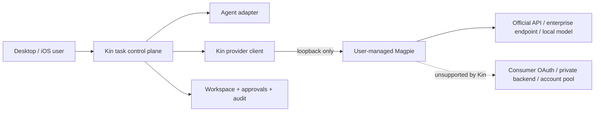

# Kin × Magpie：本地模型接入层优化方案

**状态：** 产品研究与脑暴，不是实施规格
**日期：** 2026-09-29
**研究对象：** `yetone/magpie`，源码快照
[`09abaeec`](https://github.com/yetone/magpie/tree/09abaeecf0c055dc47e96e0a22580e368e865e06)
**结论性质：** 产品与工程风险判断，不构成法律意见；服务条款会变化，上线前应重新核对。

## 0. 一页结论

### 核心判断

Magpie 和 Kin **有局部功能重叠，但核心价值互补**：

- Magpie 是本机的 **模型接入与配置平面**：统一模型目录、协议转换、Agent
  配置切换、账号/Key 路由。
- Kin 是用户拥有的 **Agent 任务控制平面**：任务生命周期、工作区、审批、
  审计、Artifacts、跨设备控制，以及按任务阶段选择 Agent 和模型。

两者真正冲突的地方不是产品主线，而是：

1. 都出现了 Provider、Model、Routing 等概念，容易让用户面对两套路由器；
2. Magpie 的“订阅共享”包含消费者 OAuth 凭据复用、私有接口调用和多账号
   池化，其中部分做法存在明显 ToS 和封号风险；
3. 若 Kin 复制这些机制，会把自己从“可信任务控制平面”拖入持续追逐私有协议
   和供应商风控的维护战。

### 推荐方向

> **Kin 不复制 Magpie；把 Magpie 作为可选、用户自管、仅本机可达的模型网关。**

推荐先做一个很薄的 **Local Gateway Bridge**：

- 用户明确点击后检测 `http://127.0.0.1:3425`；
- 从标准 `/v1/models` 读取模型，不读取 Magpie 配置文件和 OAuth 凭据；
- Kin 继续决定任务、Agent、阶段、权限和质量下限；
- Magpie 只负责协议转换和到最终模型的传输；
- 首版官方支持范围只承诺 API Key、企业授权接口和本地模型；
- 消费者订阅来源显示风险提示，不宣传“绕过 API 计费”或“榨干多个账号额度”。

### 明确不做

- 不读取 `~/.claude/.credentials.json`、`~/.codex/auth.json`、Keychain 或其他
  Agent 的登录凭据；
- 不导入 refresh token；
- 不模拟 Claude Code、Codex、Copilot、Cursor 等客户端身份；
- 不调用未公开的消费者订阅后端；
- 不做多账号轮换、限额绕过、窗口预热；
- 不把 Magpie 网关经 Kin Relay、LAN 或公网再次暴露；
- 不让 Kin 路由和 Magpie 路由同时对同一请求做隐式决策。

## 1. 我们真正要解决的问题

### How Might We

> 如何让同时使用多个 Agent 和多个模型来源的 Kin 用户，只配置一次模型接入，
> 就能在任务中可靠地选用和切换模型，同时不让 Kin 接管高风险订阅凭据，也不
> 牺牲任务级审计和权限边界？

### 目标用户

第一批用户不是普通 Chat 用户，而是：

- 同时使用 Claude Code、Codex、OpenCode 等多个 Agent 的开发者；
- 同时持有官方 API Key、公司网关、本地模型和若干订阅的人；
- 已经在手工改 `settings.json`、`config.toml`、环境变量的人；
- 希望从手机发起和审批任务，但模型调用仍发生在自己的 Desktop 上的人。

### 成功标准

- 新用户在 2 分钟内完成一次“Kin → 本地网关 → 模型”的成功调用；
- Kin 不新增保存任何第三方 OAuth/refresh token；
- 每个任务能解释“Kin 选择了什么”和“实际请求交给了哪个网关”；
- Magpie 不运行、升级不兼容或模型消失时，失败可诊断且不会静默换路；
- 接入后不会增加 Settings 页面打开时的密钥读取或第三方网络请求。

## 2. Magpie 到底是什么

根据其 README 和源码，Magpie 已经不是单纯的菜单栏模型切换器，而是五层能力
叠加：

1. **Agent 配置编辑器**：识别多个本地 Agent，原子修改其模型、Provider 和
   effort 配置，并保存/恢复 Profile。
2. **统一模型目录**：结合供应商实时列表和 `models.dev`，用
   `provider/model` 命名。
3. **多协议本地网关**：在默认 `127.0.0.1:3425` 同时提供 OpenAI Chat
   Completions、Responses、Anthropic Messages 和 Gemini 协议。
4. **请求级路由器**：支持顺序、轮换、按使用量和 reset-aware 的 smart
   routing，并维持会话亲和性。
5. **订阅凭据适配层**：把 Claude Code、Codex、Copilot、Cursor、Grok、
   Devin、Google 等已登录客户端的账号当成 Provider。

这些能力在
[README:L31-L61](https://github.com/yetone/magpie/blob/09abaeecf0c055dc47e96e0a22580e368e865e06/README.md#L31-L61)、
[README:L135-L160](https://github.com/yetone/magpie/blob/09abaeecf0c055dc47e96e0a22580e368e865e06/README.md#L135-L160)
和
[README:L172-L243](https://github.com/yetone/magpie/blob/09abaeecf0c055dc47e96e0a22580e368e865e06/README.md#L172-L243)
中都有明确描述。

### “分享订阅”有三种不同含义

讨论 ToS 前必须先拆词，否则会把完全不同的风险混在一起。

| 形态 | 实际含义 | 风险判断 |
|---|---|---|
| 同一用户调用官方 CLI | Kin 启动用户已登录的 Claude Code/Codex，由官方客户端完成调用 | 较低；仍受该客户端条款约束 |
| 同一用户跨客户端复用订阅 | OpenCode/Pi 等借 Magpie 使用 Claude/Codex 订阅 | 高；凭据用途和客户端边界发生变化 |
| 跨人或跨设备共享网关 | 其他人通过 LAN/公网消耗该账号订阅 | 很高；通常同时触及账号共享和凭据可用性边界 |

Magpie 的主要卖点是第二种；它也具备第三种的技术入口。默认 loopback 比较安全，
但源码允许 LAN 分享；更值得注意的是，直接设置 `MAGPIE_ADDR` 时存在绕过
LAN key 的开放路径，见
[`internal/gateway/lan.go:L109-L126`](https://github.com/yetone/magpie/blob/09abaeecf0c055dc47e96e0a22580e368e865e06/internal/gateway/lan.go#L109-L126)。

## 3. ToS 风险判断

### 3.1 判断原则

不能用“凭据没有上传云端”推导“符合 ToS”。ToS 关注的不只是凭据存放位置，还
包括：

- 凭据授权给了谁、用于什么客户端；
- 是否通过自动化或未公开接口访问；
- 是否伪装官方客户端；
- 是否规避配额、限流、计费或保护措施；
- 是否把个人账号能力提供给其他人或其他产品。

### 3.2 Anthropic：高风险，已有直接官方口径

Anthropic 的 Claude Code 官方文档目前写得非常明确：

- OAuth 只用于 Claude 订阅用户对 Claude Code 和其他 Anthropic 原生应用的
  正常使用；
- 开发第三方产品或服务应使用 API Key；
- 不允许第三方开发者提供 Claude.ai 登录，也不允许代表用户通过
  Free/Pro/Max 凭据路由请求。

来源：
[Claude Code Legal and Compliance](https://code.claude.com/docs/en/legal-and-compliance#authentication-and-credential-use)。

其消费者条款还限制未被明确许可的自动化访问，并禁止绕过系统或保护措施：
[Anthropic Consumer Terms §3](https://www.anthropic.com/legal/consumer-terms)。

Magpie 的实现与这一边界直接相撞：

- 它明确说明其他 Agent 的请求会借 Claude 订阅执行；
- 因第三方 system prompt 会被识别，改为驱动真实 `claude` 进程并用 MCP
  桥接调用，见
  [`claude_subscription.go:L3-L13`](https://github.com/yetone/magpie/blob/09abaeecf0c055dc47e96e0a22580e368e865e06/internal/gateway/claude_subscription.go#L3-L13)；
- 源码还保留一套构造 Claude Code billing header、官方 CLI system prefix、
  device/session metadata 和 CCH 的实现，见
  [`claude_cloak.go:L165-L216`](https://github.com/yetone/magpie/blob/09abaeecf0c055dc47e96e0a22580e368e865e06/internal/provider/claude_cloak.go#L165-L216)。
  在本次快照中，该函数的仓库内引用只出现在测试，不能据此断言它仍是生产主
  路径；当前明确主路径是上面的真实 `claude` 进程桥接。

**结论：** Kin 不应把 Claude Free/Pro/Max 经 Magpie 提供给第三方 Agent 的方式
列为官方支持能力。即使“真实 Claude Code 二进制”参与执行，也不能消除官方文档
对第三方路由的明确限制。

### 3.3 OpenAI / ChatGPT Codex：中高风险，缺少明确授权

OpenAI 官方确认 ChatGPT 订阅可登录其列出的 Codex 客户端，包括桌面端、CLI、
IDE 扩展和 Web：
[Using Codex with your ChatGPT plan](https://help.openai.com/en/articles/11369540)。

但 Magpie 不只是启动 Codex CLI。它还会：

- 读取和刷新 Codex OAuth token；
- 直接请求 `https://chatgpt.com/backend-api/codex`；
- 把多个 ChatGPT 账号并入一个 Provider；
- 在一个账号额度耗尽后切到下一个账号；
- 导入其他工具导出的 refresh token。

实现证据见
[`codex_backend.go`](https://github.com/yetone/magpie/blob/09abaeecf0c055dc47e96e0a22580e368e865e06/internal/gateway/codex_backend.go)、
[`account.go:L817-L936`](https://github.com/yetone/magpie/blob/09abaeecf0c055dc47e96e0a22580e368e865e06/internal/provider/account.go#L817-L936)
和
[`login_import.go:L3-L15`](https://github.com/yetone/magpie/blob/09abaeecf0c055dc47e96e0a22580e368e865e06/internal/provider/login_import.go#L3-L15)。

OpenAI 消费者条款禁止自动/程序化提取 Output，也禁止规避 rate limit、
restrictions、protective measures 或 safety mitigations：
[OpenAI Terms of Use](https://openai.com/policies/terms-of-use/)。

**结论：** 没有找到 OpenAI 对“第三方网关复用 ChatGPT Codex OAuth”的明确许可。
单账号、同一用户、本机使用不能直接判定为违规，但私有后端重放和多账号额度
接力具有显著执行与封号风险。Kin 不应对这一路径背书。

### 3.4 Copilot：单人本机不等于账号共享，但私有接口仍不稳

GitHub 条款要求一个 login 只能由一个人使用：
[GitHub Terms of Service §B.3](https://docs.github.com/en/site-policy/github-terms/github-terms-of-service#3-account-requirements)。
因此，同一个人本机通过不同 Agent 使用，并不天然等同于“多人共享账号”；但
一旦把 Magpie LAN 网关交给其他人，就进入明显的账号共享风险区。

另一方面，Magpie 使用 Copilot 内部 token 交换和客户端标识，不是 GitHub 对
第三方公开承诺的稳定 API。GitHub 的生成式 AI 条款允许用户构建 Agent，但没有
因此授权任意产品重放 Copilot 客户端凭据：
[GitHub Generative AI Services Terms](https://github.com/customer-terms/github-generative-ai-services-terms)。

**结论：** 单人本机使用的文本条款风险低于 Anthropic，但接口稳定性、凭据用途
和执法口径仍不确定；多人共享为高风险。

### 3.5 Google / Antigravity：高风险信号

Google 通用条款禁止绕过系统/保护措施、欺骗性访问、未经允许的自动化访问和
逆向工程：
[Google Terms](https://policies.google.com/terms)。
Google Cloud AUP 也禁止规避服务、软件或设备限制：
[Google Cloud AUP](https://cloud.google.com/terms/aup)。

Magpie 自己已在 README 中提示：Google 可能暂停在 Antigravity 外使用的账号，
并建议使用“可以承受损失”的账号，见
[README:L205-L213](https://github.com/yetone/magpie/blob/09abaeecf0c055dc47e96e0a22580e368e865e06/README.md#L205-L213)。

**结论：** 这是不应进入 Kin 官方主路径的能力。

### 3.6 其他订阅 Provider

Cursor、Grok、Devin、Qoder、Kiro、WorkBuddy 等需要逐家核对具体计划和授权
方式。仅凭“官方 CLI 能登录”不能推出“第三方网关可使用同一 token”。

Cursor 已提供公开 Cloud Agent API 和 Enterprise service account，这类官方
接口是 Kin 应优先采用的方向：
[Cursor Service Accounts](https://cursor.com/docs/account/enterprise/service-accounts)、
[Cursor Cloud Agents API](https://cursor.com/docs/cloud-agent/api/endpoints)。

### 3.7 风险分级结论

| 接入方式 | ToS 风险 | Kin 立场 |
|---|---:|---|
| 官方 API Key / 企业 API / 本地模型 | 低 | 官方支持 |
| Kin 启动用户已登录的官方 CLI | 低到中 | 保持现有 Adapter 模式 |
| 用户自管、本机 Magpie，背后仅 API Key/本地模型 | 低到中 | 可做便捷集成 |
| 消费者 OAuth 经 Magpie 给其他 Agent 使用 | 高 | 不宣传、不承诺兼容 |
| 私有端点、客户端身份模拟、refresh token 导入 | 高 | 不在 Kin 内实现 |
| 多账号池化、额度耗尽自动接力、窗口预热 | 很高 | 明确不做 |
| LAN/公网向其他人提供个人订阅 | 很高 | 明确不支持 |

## 4. 与 Kin 的冲突与互补

### 4.1 能力矩阵

| 能力 | Magpie | Kin | 关系 |
|---|---|---|---|
| Agent 配置发现与模型切换 | 强，覆盖面广，直接改配置 | 有 Agent 发现和部分运行时注入 | 重叠 |
| OpenAI/Anthropic/Gemini 协议转换 | 强 | 当前直接 Provider 以 OpenAI-compatible 为主 | Magpie 补 Kin |
| 模型/账号请求级路由 | 强 | 有任务阶段级、同 Agent fallback | 粒度不同，易双重路由 |
| 任务生命周期与持久化 | 非主线 | 核心能力 | Kin 独有 |
| 工作区隔离、diff、完成门禁 | 非主线 | 核心能力 | Kin 独有 |
| 审批、权限、审计 | 不是统一任务边界 | 核心能力 | Kin 独有 |
| iOS/跨设备控制 | 非核心 | 已有 | Kin 独有 |
| Artifacts、长期记忆、个人关系 | 非核心 | 产品长期方向 | Kin 独有 |
| 订阅账号复用与池化 | 核心卖点之一 | 不应成为核心 | 高风险差异 |

### 4.2 最大的产品冲突：两个“Routing”

Kin 的路由回答：

> 这个任务的 plan / execute / review 阶段，应该由哪个 Agent、以什么质量下限
> 和成本目标执行？

Magpie 的路由回答：

> 这个模型请求应该由哪个 Key、账号或等价模型响应？

如果两层都隐式改模型，会产生：

- Kin 的 route preview 与实际调用不一致；
- 质量下限可能被 Magpie 的 fallback 降级；
- 成本、额度和失败原因无法准确归因；
- 会话可能跨账号/模型后丢失 provider cache 或遇到加密 reasoning 不兼容；
- 用户无法判断是谁做了最终决定。

因此必须规定：

> **Kin 拥有语义路由；Magpie 只拥有传输路由。**

若用户明确选择 Magpie 的 `group/*`，Kin 应把它当作一个不透明逻辑模型，不再
对组内请求做第二次模型 fallback，并在任务历史中标记“上游由本地网关解析”。

### 4.3 为什么不应该复制 Magpie

复制会立即带来四类长期成本：

1. **协议追逐**：私有接口、Header、OAuth client ID、风控规则会持续变化。
2. **安全负担**：Kin 将直接保管消费者 refresh token 和多账号凭据。
3. **品牌风险**：Kin 的用户拥有、可审计、渐进授权，会被“绕配额工具”叙事覆盖。
4. **产品失焦**：违反 [PRINCIPLE §5.11](../../PRINCIPLE.md) 的少实体原则；
   Kin 会同时成为任务系统、Agent 管理器、协议转换器和账号池。

Magpie 的 MIT 许可意味着代码层面可以借鉴，但“可以复制”不等于“值得拥有”。

## 5. 可探索的五个方向

### A. 完整内建 Magpie

把协议转换、Provider preset、订阅 OAuth、多账号和路由全部并入 Kin。

- 用户价值：表面最高，一站式；
- 可行性：低，维护面和风控面持续膨胀；
- 差异化：低，变成另一个 Magpie；
- 致命问题：ToS、凭据安全、产品定位失焦。

**结论：拒绝。**

### B. 把 Magpie 当作普通 OpenAI-compatible Provider

用户手工填写 `http://127.0.0.1:3425/v1`、模型 ID 和任意本地 token。

- 用户价值：今天大概率已经可用；
- 可行性：高，无需新架构；
- 问题：发现、状态、模型同步和风险说明不足。

**结论：作为零开发验证基线。**

### C. Local Gateway Bridge

在现有 Provider UI 上增加“检测本地网关”，对 Magpie 做轻量识别和标准模型
发现，但不读取它的配置与凭据。

- 用户价值：高，消除重复录入和模型 ID 猜测；
- 可行性：高，复用现有 Provider registry、`/v1/models` 和 route events；
- 差异化：Kin 能把任意本地模型接入层纳入可审计任务，而不是重新做网关。

**结论：推荐。**

### D. 与 Magpie 建立可观测扩展协议

推动一个可选的本地 capability/provenance API，让 Kin知道最终 Provider、
model、auth class、route group 和 quota 状态，但永不接触凭据。

- 用户价值：中高，解决双重路由和审计盲区；
- 可行性：中，需要上游协作和版本协议；
- 风险：容易演化成 Magpie 私有耦合。

**结论：P1 探索，优先做成供应商中立协议。**

### E. 只借鉴 UX，不做集成

借鉴模型实时发现、Agent × Model 总览、配置漂移提示和 route trace。

- 用户价值：中；
- 可行性：高；
- 问题：用户仍需在两边重复配置。

**结论：无论是否集成都应吸收，但不能替代 C。**

## 6. 推荐产品方案：Local Gateway Bridge

### 6.1 产品定位

对外不要叫“订阅共享”，建议叫：

> **Local Model Gateway / 本地模型网关**

一句话：

> Kin 负责把工作做好并让过程可控；本地网关负责把模型接进来。

### 6.2 用户路径

1. 用户进入 `Settings → Providers → Add provider`。
2. 选择 `Local gateway`，点击 `Detect`.
3. Kin 只探测 loopback 上的候选端口，首个适配是 Magpie `3425`。
4. 用户确认后，Kin 显式请求 `/v1/models`。
5. 用户挑选允许 Kin 使用的模型并标注质量档位；不默认全选。
6. 创建 Provider `magpie-local`，显示：
   - Endpoint：`127.0.0.1`
   - Managed by：Magpie
   - Credentials：not stored by Kin
   - Routing：fixed model 或 external group
7. 创建任务时仍使用 Kin 的 Auto/Manual 选择器。
8. 任务详情显示：
   `Kin → magpie-local → provider/model`
9. Magpie 不可用时，显示“本地网关未运行/模型已移除”；只有用户配置过的 Kin
   fallback 才能继续。

### 6.3 架构边界



关键约束：

- iOS 只连接 Kin daemon，不直连 Magpie；
- Magpie 地址必须解析为 true loopback，首版拒绝 LAN、Tailnet、Relay 和公网地址；
- Kin 不读取 Magpie 的 `providers.json`、`logins.json` 或 Agent 凭据目录；
- 打开 Settings 不自动探测；只有 `Detect`、`Refresh models`、`Test` 等显式动作
  才访问网关；
- Provider API 返回的模型和元数据视为不可信输入，限制数量、字段长度和响应体；
- 不自动安装、启动、升级或修改 Magpie；
- 不把“Magpie 可用”解释为“其所有上游来源均符合 ToS”。

### 6.4 路由所有权

支持两种明确模式，不做模糊叠加：

| 模式 | Kin | Magpie |
|---|---|---|
| Fixed model，推荐 | 选择任务阶段、Agent、具体 `provider/model` 和 Kin fallback | 配置为单一上游时只做协议转换与发送 |
| External group，高级 | 选择 `group/id`，记录其为 opaque route，不做组内 fallback | 决定组内账号/模型 |

Kin 的任务审计至少记录：

- requested model；
- gateway provider ID；
- fixed / external-group；
- 请求是否重试；
- Kin 能观察到的 token、latency 和错误；
- “最终上游由用户自管网关决定”的事实。

不能获得的事实不得伪装成确定值。

### 6.5 ToS 风险 UX

不需要做一套法律中心，但需要在现有 Provider 表单内给出短而明确的来源标签：

- `Official API / Enterprise`：适合自动化；
- `Local model`：数据留在本机，仍需检查模型许可；
- `User-managed gateway`：Kin 不管理其凭据和上游条款；
- `Consumer subscription`：可能只允许官方客户端，存在暂停账号风险。

风险提示只在连接或首次选择高风险来源时出现，不在每次任务中打扰用户。

## 7. Kin 可以立即吸收的产品能力

### 7.1 从“填表”升级为“发现后确认”

Kin 已有 Provider 表单和显式 `Fetch models`：
[`ProviderSettingsSection.tsx`](../../ui/src/components/settings/ProviderSettingsSection.tsx)。
下一步不应继续增加更多输入框，而应加入：

- 检测常见本地 endpoint；
- 获取真实模型列表；
- 显示最近一次成功连接和模型列表更新时间；
- 让用户确认哪些模型进入 Kin，而不是全量导入。

### 7.2 增加 Agent × Model 的只读总览

Magpie 最好的 UX 不是网关，而是一眼看见“每个 Agent 当前用什么”。Kin 可以在
Agents 页增加只读运行态摘要：

```text
Claude Code  → native subscription
Codex        → native subscription
Kin          → magpie-local/deepseek-chat
Routine      → routing profile: cost-min
```

这不是第二套配置页，而是帮助用户发现漂移、错误 Provider 和意外高成本路由。

### 7.3 坚持进程级覆盖，不改用户全局配置

Magpie 擅长“外科手术式修改”全局配置，但 Kin 更适合按任务注入：

- 不影响用户在终端里独立运行 Agent；
- 每个 Task 的 Provider/Model 可重放、可审计；
- 任务结束后无需恢复配置；
- 并发任务不会互相覆盖。

Claude Code adapter 已有按运行注入 Provider 环境变量的基础：
[`internal/adapter/claudecode/adapter.go:L145-L169`](../../internal/adapter/claudecode/adapter.go#L145-L169)。
Codex adapter 目前没有等价的 `ProviderCfg` 应用路径：
[`internal/adapter/codex/adapter.go:L46-L88`](../../internal/adapter/codex/adapter.go#L46-L88)。
若后续要让外部 Agent 经 Magpie 运行，应先补齐可测试的 per-run override，而不是
让 Kin 修改 `~/.codex/config.toml`。

### 7.4 收紧 `subscription` 的产品语义

Kin 路由模型中已经存在 `ProviderKindSubscription`，但应明确：

> `subscription` 表示“由官方 Agent 自己持有和使用登录”，不是“Kin 可以读取
> OAuth token 并把它变成通用 Provider”。

这条语义应进入文档和未来校验，避免实现者顺着 Magpie 的路径扩大凭据边界。

## 8. MVP 范围

### P0：零开发 Dogfood，1 天

用现有 Provider 表单手工配置：

```text
name:     Magpie Local
base_url: http://127.0.0.1:3425/v1
api_key:  magpie
model:    <一个由 API Key 或本地模型提供的 provider/model>
```

只验证 Kin 内建 Agent：

- 普通对话；
- tool call；
- streaming；
- 取消；
- 429/5xx；
- Magpie 停止；
- 模型被移除。

不使用消费者订阅做验证。

### P0.5：原生 Local Gateway 入口，约 3–5 天

- 增加 `Local gateway` 预设和显式 Detect；
- 只允许 loopback；
- 复用 `/v1/models`；
- 导入模型时要求用户确认；
- 在现有 Provider entry 上记录显示来源，不新增顶级产品实体；
- 增加中英文 i18n、API 边界测试和 UI 状态测试。

### P1：可观测性与外部 Agent，证据驱动

- 定义供应商中立的 gateway capability/provenance 草案；
- 与 Magpie 上游讨论是否能返回实际 route 的非敏感元数据；
- 对固定模型与 `group/*` 分别处理；
- 补齐 Codex 等 Agent 的 per-run Provider override；
- 加入协议 conformance：stream、tool call、usage、cancel、错误分类、长上下文。

### P2：是否深化合作

只有以下条件同时成立才继续：

- 至少 5 名真实用户持续使用本地网关接入；
- 主要价值来自统一配置和模型可用性，而不是绕过订阅限制；
- Magpie 提供稳定、版本化、无凭据暴露的能力接口；
- Kin 能保持单一任务审计和明确路由所有权；
- 维护者愿意公开说明高风险订阅能力的边界。

## 9. 关键假设与验证

### 必须为真

- [ ] 多 Agent 用户确实把重复配置和模型切换视为高频痛点。
  验证：访谈 5–8 名同时使用至少两个 Agent 的用户，记录每周切换次数和当前
  workaround。
- [ ] Magpie 的标准接口能稳定承载 Kin tool loop。
  验证：固定 payload 回放，覆盖 streaming、并行 tool call、错误重试和取消。
- [ ] 不接触订阅凭据仍能提供足够价值。
  验证：P0 只用 API Key/本地模型 dogfood 两周；若用户只为订阅池化而来，停止
  专项集成。

### 应该为真

- [ ] 用户能理解“Kin 路由”和“Gateway 路由”的区别。
  验证：用任务路线图测试，不增加解释性长文。
- [ ] `/v1/models` 对 Magpie 版本升级足够稳定。
  验证：至少覆盖当前版和后续两个版本，失败时保留 last-known catalog。
- [ ] Magpie 进程故障不会破坏 Kin 任务状态。
  验证：执行中 kill/restart，确保任务得到明确错误或按 Kin 策略恢复。

### 可能为真

- [ ] 用户希望在 Kin 中看到 Magpie quota。
- [ ] 用户希望从 Kin 跳转到 Magpie 的 Provider 配置页。
- [ ] 供应商中立的 provenance 协议能被 LiteLLM、CLIProxyAPI 等复用。

这些不是 MVP 前提，不应提前建模。

## 10. 预演失败

假设 6 个月后方案失败，最可能是：

1. **用户以为 Kin 官方支持订阅绕路，账号被封后归责 Kin。**
   对策：官方文档只演示 API Key/本地模型；来源标签和首次风险确认。
2. **双重路由导致实际模型不可解释。**
   对策：fixed 与 opaque group 二选一；同一层只允许一个路由所有者。
3. **Magpie 升级后协议变化，Kin 大面积失败。**
   对策：只依赖标准 endpoint；版本探测、conformance fixture、清晰降级。
4. **本地网关被错误暴露到网络，个人订阅变成共享服务。**
   对策：首版 true-loopback-only，移动端永远经 Kin task API，不代理模型 API。
5. **接入没有真实增益，只增加一个品牌和设置项。**
   对策：先手工 dogfood；未达到使用频率和完成率门槛则不做原生入口。
6. **Kin 逐步复制 Magpie 的 Provider UI 和账号池。**
   对策：把“不读取 OAuth、不管理账号池、不改全局 Agent 配置”写成产品边界。

## 11. Not Doing

- **不做消费者订阅聚合器**：ToS 与维护风险远大于 Kin 的战略价值。
- **不做“所有 Agent 的全局配置管家”**：Kin 按任务运行，不应抢占用户终端配置。
- **不做第二个请求级智能路由器**：Kin 已有任务阶段路由，双重决策会破坏审计。
- **不 Fork 或内嵌 Magpie**：优先保持进程边界，避免同步其快速变化的内部实现。
- **不把 Magpie 设为必需依赖**：官方 API、本地模型和直接 Agent CLI 路径继续独立。
- **不为高风险来源做自动 fallback**：用户必须明确选择并承担其上游条款风险。
- **不在被动页面读取密钥或探测第三方**：遵守 Kin 的外部集成 UX gate。

## 12. 最终建议

### 现在

1. 把 Magpie 当作一个优秀的、可选的本地模型接入层，而不是竞品主线。
2. 用 API Key/本地模型完成一次手工互操作验证。
3. 在 Kin 文档中明确 `subscription` 只表示官方 Agent 自管登录。
4. 不对 Magpie 的消费者订阅复用能力做官方推荐。

### 下一步

若 P0 验证成功，做一个很薄的 Local Gateway 入口：检测、模型发现、显式连接、
loopback 限制和任务 provenance。不要先做账号、quota、Profile 导入。

### 长期产品叙事

两者可以形成清晰分工：

> **Magpie makes models available. Kin makes agents accountable.**

中文可以表达为：

> **Magpie 把模型接进来，Kin 把工作管起来。**

这个关系能增强 Kin，又不会把 Kin 的可信控制面建立在消费者订阅漏洞、私有协议
或供应商暂时未封堵的行为上。

## 13. 资料与证据范围

### Magpie

- [Repository README, pinned commit](https://github.com/yetone/magpie/blob/09abaeecf0c055dc47e96e0a22580e368e865e06/README.md)
- [Claude subscription bridge](https://github.com/yetone/magpie/blob/09abaeecf0c055dc47e96e0a22580e368e865e06/internal/gateway/claude_subscription.go)
- [Claude wire identity construction](https://github.com/yetone/magpie/blob/09abaeecf0c055dc47e96e0a22580e368e865e06/internal/provider/claude_cloak.go)
- [Codex backend bridge](https://github.com/yetone/magpie/blob/09abaeecf0c055dc47e96e0a22580e368e865e06/internal/gateway/codex_backend.go)
- [Account credential handling](https://github.com/yetone/magpie/blob/09abaeecf0c055dc47e96e0a22580e368e865e06/internal/provider/account.go)
- [Login import](https://github.com/yetone/magpie/blob/09abaeecf0c055dc47e96e0a22580e368e865e06/internal/provider/login_import.go)
- [Gateway LAN guard](https://github.com/yetone/magpie/blob/09abaeecf0c055dc47e96e0a22580e368e865e06/internal/gateway/lan.go)

### 官方条款与文档

- [Anthropic Consumer Terms](https://www.anthropic.com/legal/consumer-terms)
- [Claude Code Legal and Compliance](https://code.claude.com/docs/en/legal-and-compliance)
- [OpenAI Terms of Use](https://openai.com/policies/terms-of-use/)
- [OpenAI Service Terms](https://openai.com/policies/service-terms/)
- [Using Codex with your ChatGPT plan](https://help.openai.com/en/articles/11369540)
- [GitHub Terms of Service](https://docs.github.com/en/site-policy/github-terms/github-terms-of-service)
- [GitHub Terms for Additional Products and Features](https://docs.github.com/en/site-policy/github-terms/github-terms-for-additional-products-and-features)
- [Google Terms](https://policies.google.com/terms)
- [Google Cloud Acceptable Use Policy](https://cloud.google.com/terms/aup)
- [Cursor Terms of Service](https://cursor.com/terms-of-service)
- [Cursor Service Accounts](https://cursor.com/docs/account/enterprise/service-accounts)

### Kin

- [Product Principles](../../PRINCIPLE.md)
- [System Design](../../SYSTEM_DESIGN.md)
- [Provider and Kin Agent ADR](../adr/0001-provider-and-kin-agent.md)
- [Pluggable Agent Runtime ADR](../adr/0007-pluggable-agent-runtime.md)
- [Auto Model Routing Plan](../plans/2026-07-28-auto-model-routing.md)
- [Agent Platform Gap-Closure Plan](../plans/2026-09-17-agent-platform-gap-closure.md)

**证据限制：** 本文审阅了 2026-09-29 的 Magpie 主分支源码和公开文档，没有
使用真实消费者账号进行流量测试，也没有获得任何供应商的书面授权确认。除
Anthropic 已明确发布第三方凭据路由禁令外，其他供应商结论均是基于公开条款、
公开客户端范围和实现方式作出的风险分级，不应表述为确定的法律裁决。
